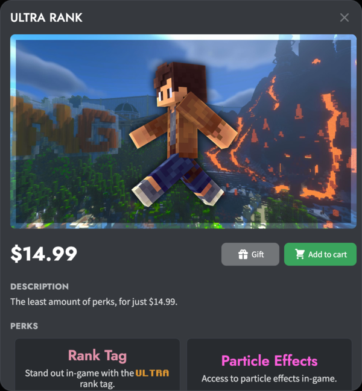
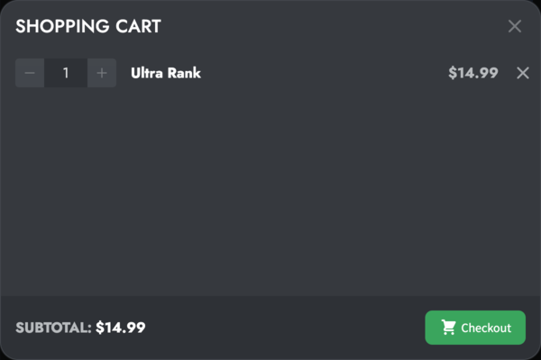
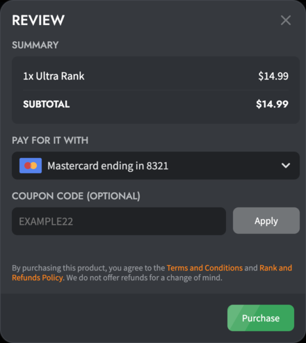
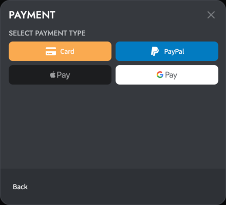

# Buying a Premium Rank

To buy a rank, open the NetherGames Store.

Please choose one of the ranks above to view its price, perks, and eligibility.

::: info PLEASE NOTE
If you already own Ultra or Emerald, upgrading your rank to a higher one is discounted so that you would pay the same price you would've if you bought that higher rank orginally.
:::

You can either buy the rank for yourself or create a gift code to be used by other players.

## Buying for yourself

After signing in with Xbox Live (we do not support Safari on iOS and iPadOS due to technical constraints), press "Add to cart."

When added to the cart, press the shiny golden "Cart" button unless you intend to add more items to checkout.

In your shopping cart, review your cart and press the "Checkout" button.

In the review modal, choose your desired payment method and apply a coupon code optionally.
Currently, we support card payments from major brands such as Mastercard, Visa, American Express, and PayPal.
You can also autocomplete your card information for future purchases using Google Pay or Apple Pay if supported on your device.
When using PayPal, remember to complete the mandatory authorization for every purchase. To avoid this, add a card instead.

Once you have a valid payment method with sufficient funds, press "Purchase." We will present you with a success or error message. Feel free to contact live chat at the bottom of [ngmc.co/lc](https://ngmc.co/lc) if you need clarification on what an error means.

## Buying a gift

After signing in with Xbox Live, press "Gift."

In the review modal, choose your desired payment method and apply a coupon code optionally.
Currently, we support card payments from major brands such as Mastercard, Visa, American Express, and PayPal.
You can also autocomplete your card information for future purchases using Google Pay or Apple Pay if supported on your device.
When using PayPal, remember to complete the mandatory authorization for every purchase. To avoid this, add a card instead.

Once you have a valid payment method with sufficient funds, press "Purchase." We will present you with a success or error message. Feel free to contact live chat at the bottom of [ngmc.co/lc](https://ngmc.co/lc) if you need clarification on what an error means.
After successfully purchasing a gift, the settings modal will appear (which you can open again by pressing your username in the upper-right corner).

You can now copy this gift code URL to share with friends and family or in giveaways. It expires in 48 hours, but you can generate a new one anytime.
