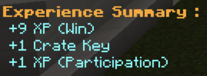

# Cosmetic Crate Keys

::: warning PLEASE NOTE
This article is about crate keys that redeem cosmetics. Factions crate keys are separate from cosmetic crate keys and are earned differently.
:::

Cosmetic crate keys allow players to redeem certain cosmetics on the network, including coloured armour for use in the lobby, the type of knife if you're the murderer in Murder Mystery, arrow trails, kill effects, particles, trails, and win effects.

You can earn keys in any game mode (except on Creative, Skyblock, and Factions). Winning one of these games grants you roughly a 5% chance of winning a key.

If it's your lucky day, we will notify you of your winnings in the Experience Summary message sent after you win a game.

To redeem your keys, find the chest in the lobby and click on it to claim your prize!

## Crate Key list
Crate keys all have the same chance of being dropped. There is no cosmetic rarity and an it is not possible to get the same cosmetic twice. Once you have collected all cosmetics, you will be unable to open Crates until more cosmetics are added to the server.

The following Cosmetic Types exist:
- Trails
- Arrow Trails
- Kill Effects 
- Win Effects (All minigames)
- Particles
- Helmet (Lobby)
- Chestplate (Lobby)
- Leggings (Lobby)
- Boots (Lobby)
- Knife (Murder Mystery)
- Wings (Lobby)
- Bed Break Effects (Bedwars)
- Cage (Skywars, The Bridge)
- Capes
- Kill Sounds (All minigames)
- Bed Break Sounds (Bedwars)
- Shopkeeper (Bedwars)
- Flag (Conquests)

## Trails
Trails will add the currently selected particle type as particles behind you when you're running.

The following particles are available:
- Flame
- Redstone
- Heart
- Enchantment
- Water Drip
- Lava Drip 
- Angry villager
- Happy Villager
- Portal 
- Smoke
- Rainbow

## Arrow Trails
Arrow Trails will add the currently selected particle type as a trail behind any arrow you fire.

The following particles are available:
- Flame
- Redstone
- Heart
- Enchantment
- Water Drip
- Lava Drip 
- Angry villager
- Happy Villager
- Portal 
- Smoke
- Rainbow

## Kill Effects
Kill effects are played whenever you kill a player in any minigame.

The following kill effects are available:
- Sphere Firework
- Star Firework
- Creeper Firework
- Burst Firework
- Lightning
- Explosion

## Win Effects
Win effects are played whenever you win any minigame.

The following win effects are available:
- Sphere Firework
- Star Firework
- Creeper Firework
- Burst Firework
- Lightning
- Explosion

## Particles
Generic Particles that surround you in the lobby.

The following particles are available:
- Flame
- Redstone
- Heart
- Enchantment
- Water Drip
- Lava Drip 
- Angry villager
- Happy Villager
- Portal 
- Smoke
- Rainbow

## Colored Armor
Available in the lobby and uses the vanilla minecraft leather taints, and in addition also includes rainbow armor. Each color has to be separately obtained per armor piece (Helmet, Chestplate, Leggings, Boots). This armor will only show in the Lobby.

## Knife
Knifes are only available in Murder Mystery and allows you to choose between the following knife types:
- Wooden
- Stone
- Iron
- Gold
- Diamond

## Wings 
Wings are particles that form wings behind you in the lobby.

The following wings are available:
- Flame
- Redstone
- Heart
- Enchantment
- Water Drip
- Lava Drip 
- Angry villager
- Happy Villager
- Portal 
- Smoke
- Rainbow

## Bed Break Effects
Bed Break Effects are triggered whenever you destroy an opponents bed in Bedwars

The following bed break effects are available:
- Sphere Firework
- Star Firework
- Creeper Firework
- Burst Firework
- Lightning
- Explosion

## Cage
Cages are cosmetics for the cages that you spawn in when playing Skywars and The Bridge.

The following types of cages are available:
- White
- Orange
- Magenta
- Light Blue
- Yellow
- Lime
- Pink
- Gray
- Light Gray
- Cyan
- Purple
- Blue
- Brown
- Green
- Red
- Black
- Rainbow
- Witch Pot
 
Please note that the colors in this list refer to glass blocks.

## Capes
Capes can be worn throughout the server on a players back.
The following capes can be obtained:
- Claw
- Cookies
- Creeper 1
- Creeper 2
- Creeper 3
- Fox
- Golem
- Optifine
- Sword
- Mage
- Shulker
- Pirate
  
Please note that there are more capes available, which can only be obtained by acquiring certain levels, participating in events or being a staff member. These are not included in crate keys.

## Kill Sounds
Kill sounds are played to all nearby players when you eliminate a player in a game.

The following kill sounds are available:
- Orb Ding
- Level Up Ding
- Bell Ding
- Classic Pop
- Modest Pop
- Explosion
- Hurt
- Anvil Crash
- Firework Blast
- Large Firework Blast
- Fizz

## Bed Break Sounds (FX)
Bed Break sounds are played whenever you destroy an opponents bed in Bedwars.
The following sounds are available.
- Orb Ding
- Level Up Ding
- Bell Ding
- Classic Pop
- Modest Pop
- Explosion
- Hurt
- Anvil Crash
- Firework Blast
- Large Firework Blast
- Fizz

## Shopkeepers
Shopkeepers are different in the way that they are not obtainable through crate keys.

## Flags
Conquest flags are different in the way that they are not obtainable through crate keys
