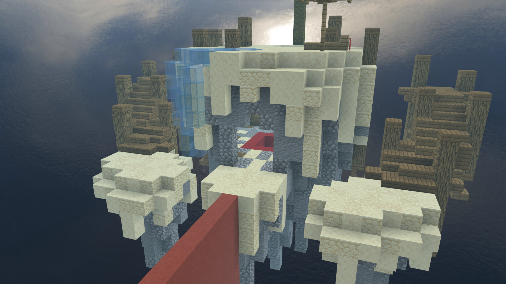
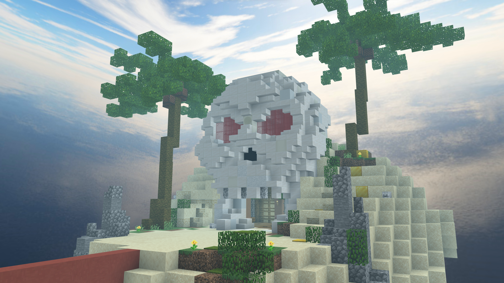
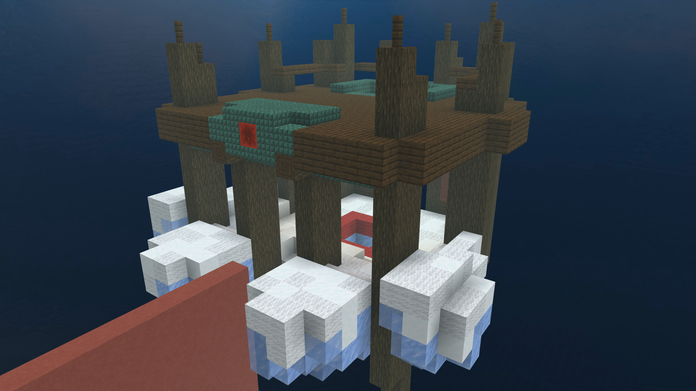
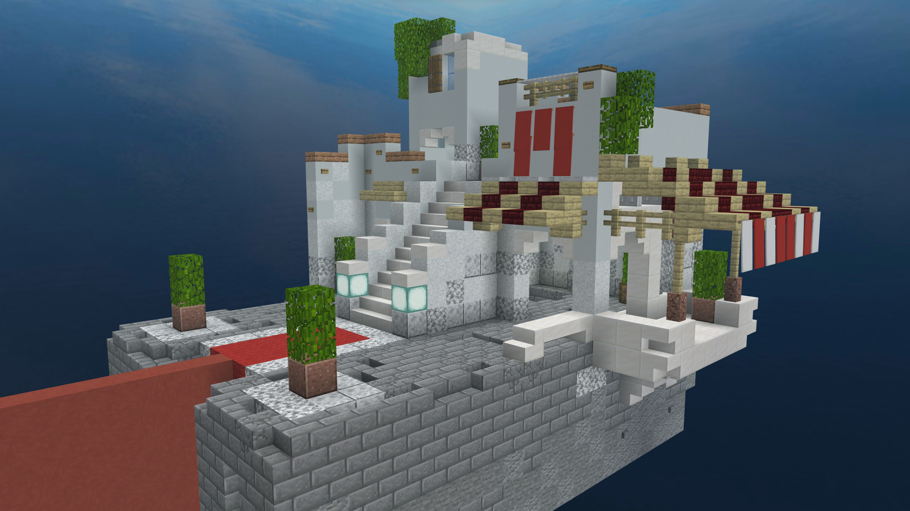
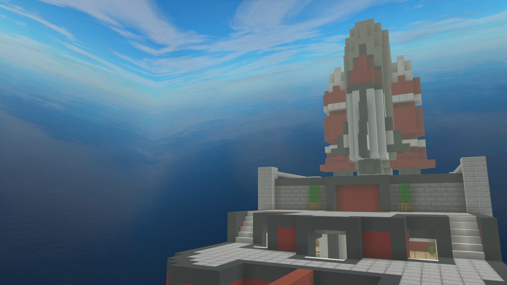
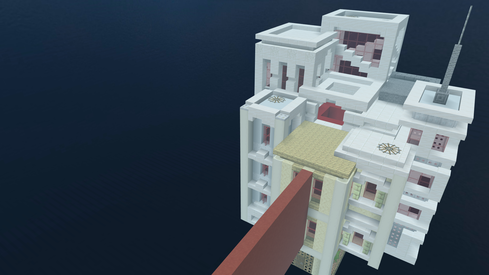

# Map Rotations

## Map rotation timeline

* **Rotation 1:** January 10th to March 31st
* **Rotation 2:** April 1st to June 30th
* **Rotation 3:** July 1st to October 14th
* **Rotation 3 + Halloween Maps:** October 15th to November 14th
* **Rotation 4:** November 15th to December 9th
* **Rotation 4 + Winter Holiday Maps:** December 10th to January 9th

The map rotation is a system NetherGames has in place to keep maps fresh and different. This is a list of all currently rotated maps for all gamemodes in the program.

## Quick access

[Bedwars](#bedwars)

[Conquests](#conquests)

[Murder Mystery](#murder-mystery)

[Skywars](#skywars)

[The Bridge](#the-bridge)

[Duels](#duels)

## Bedwars

### Solo/Duos
**Aquaduct**

**Celestial**  

**Exodus**  

**Fallen**  

**Fastfood**  

**Industrial**  

**Lighthouse**  

**Perished**  

**Royal**  

**Stumped (NEW)**  

**Unearthed**  

### Squads
**Ancient City**  

**Forsaken**  

**Hive**

**Nexus**

**Elysinia**

**Fungal**

**Harmony**

**Ukiyo**

## Conquests
**Antiques**

**Prey**

**Toluca**

**Woodlands**

## Murder Mystery
**Academy**

**Arid (NEW)**

**Asylum**

**Haven**

**Mall**

**Rome (NEW)**

## Skywars

### Regular
**Bonsai**

**Construction**

**District**

**Doughnut (NEW)**

**Elowen**

**Hades**

**Ingress**

**Jura (NEW)**

**Mines**

**Seafloor**

**Summer**

**Swale**

**Sweets**

**Toys**

**Western**

### Duels (SW)
**Burried**

**Narra**

**Scaffolds**

**Shafts**

**Solar**

## The Bridge
**Blox (NEW)**

**Castle**

**Coast**

**Crossbones**

**Frostbite (NEW)**

**Aegean**

**Overgrown (REVAMPED)**

**Shuttle**

**Skyscrapers (NEW)**

**Solice**

## Duels
**Entryway**

**Familiar**

**Meadow**

**Mindgames**

**Nature**

**Oriental**

**Paradise**

**Spaceport**

