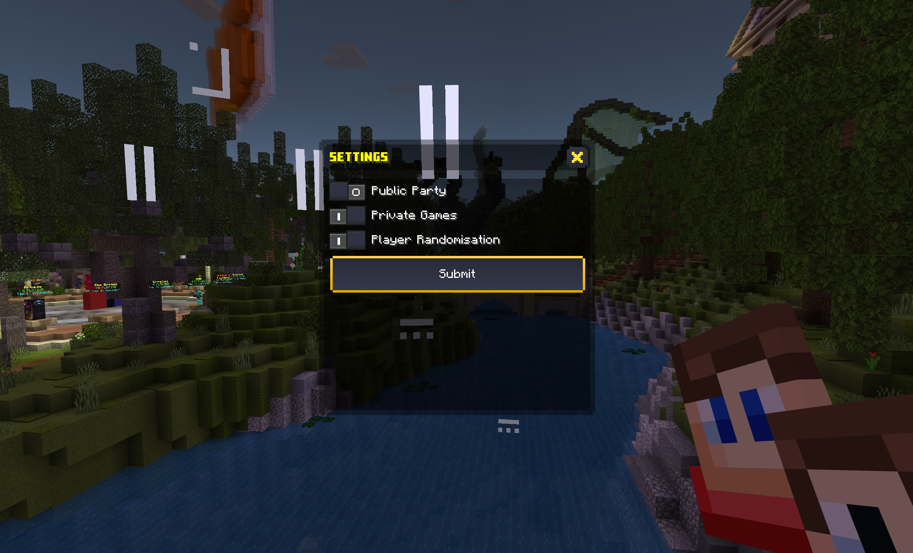
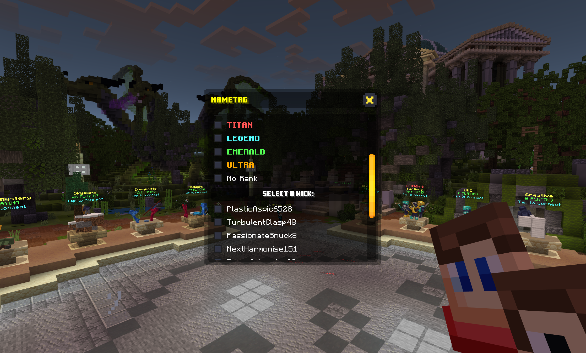
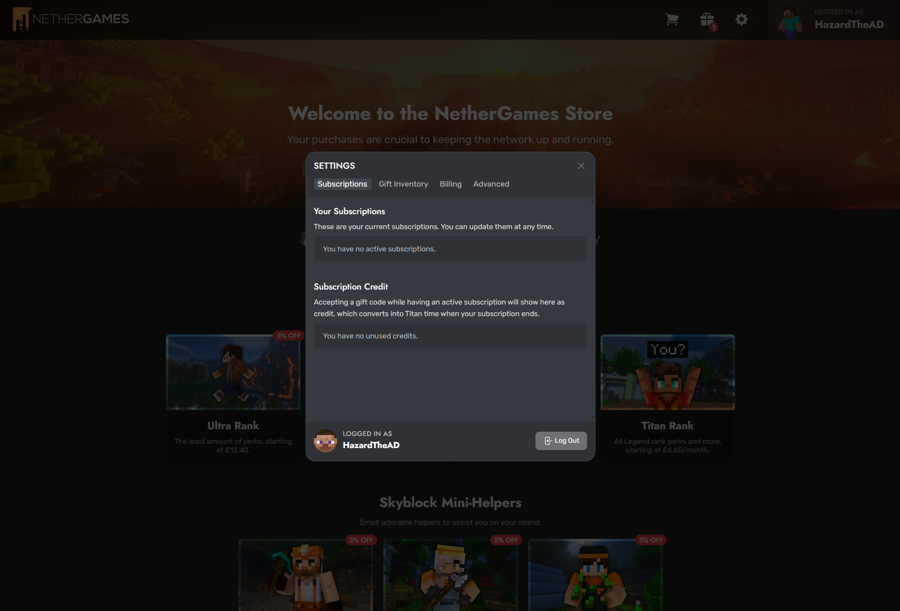

# Titan Frequently Asked Questions

## How can I create a Private Game? 🎮
You can create a private game by following these steps from the lobby:
* Open the Social Menu in your hotbar (👨‍👧 icon).
* Select Parties > Create Party > Settings > Private Games > Submit.

  
## How can I change my Rank Tag? 📖
::: info Got Multiple Ranks?
If you have multiple ranks, you can choose between Ultra, Emerald, Legend, or Titan.
:::
* To start, head over to the Social Menu, which can be identified by the two friends in your Hotbar 👨‍👧 (8th item slot).
* Great! Now, select "NameTag Settings" and select your shiny new rank.

* Finally, scroll down to the bottom and select "Submit" to confirm your changes. Your rank prefix will now be enabled!

## How can I change my Nickname? 📖
* Similar to how you change your rank tag, head over to your Social Menu and select "Nametag Settings".
* Now, scroll/swipe down to "Change Your Nick", and tap/click on the text box.
* Enter your desired nickname, then tap/click on "Submit".
::: warning Nickname Policy
Please do not abuse the use of custom nicknames by impersonating staff, partners, or other players with bad intent. If you are caught impersonating others you may be held responsible and receive punishment. For more information please visit [NetherGames Guidelines](https://support.nethergames.org/enforcement-system#other:~:text=Inappropriate%20Nickname/Pet%20Name).
:::

## How can I fly around in the lobby? 🦸
If you are new to Titan, you might want to show off your new perks, such as flight! To enable flight, head to "Profile Settings" in your Hotbar ⚙️ (9th item slot).
* Tap/click on "Toggle Fly".
* Tap/click on "Submit".
* Double jump to enable flight, and do the same to disable flight.

## How can I watch Replays? ⏪
* Head to "Profile Settings" in your Hotbar ⚙️ (9th item slot).
* Tap/click the "Replays" button.
From here, you can "Search by ReplayID" or you can view replays of your "Recent Matches". 

## How can I enable my Red Guild Tag 🟥
* Head back over to your "Social Menu" (8th item slot) and tap/click "Guilds"
* Scroll/Swipe down to "Change guild tag" and tap/click on the button.
* Choose your fancy new red Guild Tag and tap/click the "Submit" button.
::: warning PLEASE NOTE
Your guild must be at least level 25 to use this feature.
:::

## How can I use my 5% Titan discount on the store? 💳
Your Titan rank grants you a 5% discount on the NetherGames store. As long as you are logged into your Minecraft account that has the Titan rank applied, the store will automatically discount your purchase at checkout.

## When will my payment be renewed? 💳
Your Titan rank payment will renew 30 days from when you purchased the rank subscription. If you have purchased Titan for 1 year, 6 months, or 3 months, then your Titan rank will renew after that period. Payments are automatically renewed unless cancelled. If you wish to cancel your Titan rank, please see below.

## How can I cancel my Titan rank? 🚫
::: tip Store Login
Remember to log in with the Xbox LIVE account you use to play NetherGames with your Titan subscription, otherwise, you may not see the option to cancel your Titan subscription.
:::
To cancel your Titan rank, you can visit the [NetherGames Store](https://ngmc.co/store) and click on the gear icon to open your store User Settings. This will open up the "Subscriptions" tab where you can cancel or make changes to your active Titan rank subscription.
