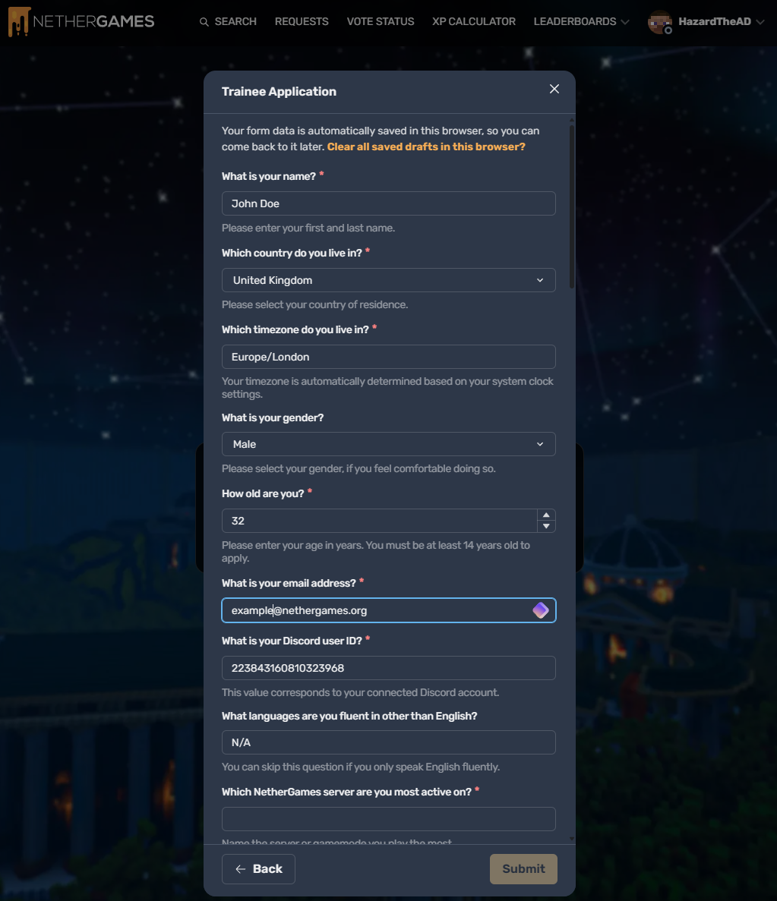
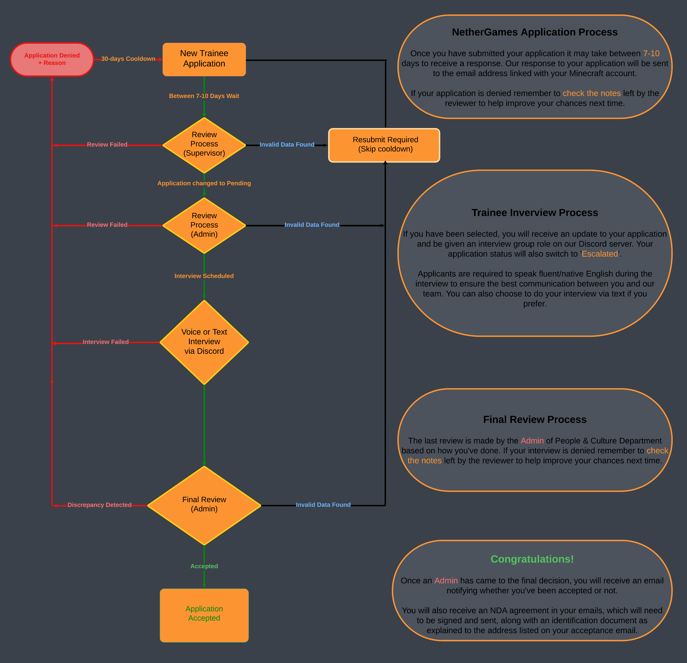

# The Trainee Process Explained
 Thanks for taking an interest in applying for a Trainee position at NetherGames, we're excited to see what you can bring to our team. If you have already applied, great! Below we will go into further detail about how we choose our applicants, the application process, and what we look for in an applicant. We will also discuss the basic roles of a Trainee and the tasks they will be given once they receive that fancy yellow tag.

 ## The Application Process 📝
 One of the first steps you will experience on your journey to becoming a Trainee is the application. To apply, you will need to submit a **Trainee** application which can be done [HERE](https://ngmc.co/request)! You may need to sign in to your NetherGames Portal account to view the page. All done? Perfect! Now, you might notice a few requirements that must be met before you can start your application. These include:
 
 * Having your Discord account connected
 * Have been in the NetherGames Discord server for at least 30 days.
 * Joined the NetherGames Minecraft network more than 30 days ago.
 * No pending Trainee applications.
 * No active punishments on your account.
 * Not be a current Trainee on your account.

If you meet these requirements, you can press the "Continue" button, which will take you to the main application form.

### Filling out your application

When filling out your application, please provide as much detail as possible, and try not to include false information. We search for Trainees based on their skills, attitude, typing, grammar/spelling skills, ability to detect a cheater, activity on the network, and more. We understand that there are a lot of questions to get through, and some might be hard to answer. However, this is the best method to help. If you are struggling with a question or require additional assistance, then you can always send a DM to our ModMail bot, where staff will provide tips, but not the answers to scenarios. 

::: info PLEASE NOTE
Staff cannot provide the exact answer to the Trainee scenario questions. 
:::

Once you have finished filling out your Trainee application form, press the "Submit" button to send your application to our review department. Below we have also provided a chart on how our team reviews Trainee applications, as well as the application process in further detail. If you do not receive a response to your application after 7-10 days, please reach out to a member of our team by DMing our ModMail bot on Discord.

## The Review Stage
While we are unable to explain much about the inner workings of our review process, we check everything to ensure a potential candidate meets the high standards we look for when selecting new Trainees. Many things are taken into consideration such as:

* Behaviour on the network
* Behaviour on our Discord server
* Both expired and active punishments
* How you responded to the trainee application form questions and scenarios.

A supervisor will check a Trainee's application first, and if they feel a candidate has potential, they will start a background check on them. If the background is clear, the status of the application will be changed to "Escalated" and will be awaiting the final review of an Admin of People & Culture. After the Admin has reviewed your application and has given the all-clear, the Trainee's application status will change once more to "Approved", meaning they have been selected for an interview with a member of our team.

## The Interview Stage
When a Trainee reaches this stage, they will be given a Discord role and assigned to an interview channel. In this channel, they will discuss the best time the Trainee is available for their interview as well as other questions they might have about questions on the application form. Trainee candidates can choose whether they would like to do their interview in text, or voice, however, **all interviews must be done in English**. During voice interviews, our interviewers may take notes from the start to the finish so that they can be taken into consideration during the final review process.

### The Final Review
The final review will consider both their interview and application form. This is usually done by an Admin of People & Culture. Not much information can be provided about this stage, as it is seen as a 'look over' before the final decision, and doesn't usually take much thought.

## Acceptance
Acceptance is the moment a Trainee has been waiting for. The applicant will receive an email with further steps before being assigned their fancy new Trainee tag in-game and Discord role. One of the most important steps during this process is to read and review the NetherGames Non-Disclosure-Agreement. This agreement is to be signed by all NetherGames staff to ensure that everyone is willing to respect the Staff Team privacy and keep all information and resources distributed confidential. Every applicant will also be required to provided an identification document to prove their identity. We care about your privacy just like we care about ours. You will be allowed to censor information like addresses or photos, but you will be required to provide a full picture of the document to prove its validity, and your full name and date of birth must be fully visible.
Once signed, the applicant will need to send an email with the agreement and the picture of the identification document as an attachment to the NetherGames People & Culture Department. When the documents have been received, an Admin will assign the Trainee's roles across the network. Finally, the Admin will create an announcement within the Staff Announcements channel on Discord informing all staff about the new Trainee, allowing everyone to introduce themselves.

# What will I do during the Trainee Program?
As a Trainee, you will be trained by our mentor team, teaching you new skills and further information about how NetherGames moderation works. **You will learn about different types of punishments**, both in-game and on our Discord server. You will also notice access to **additional commands in-game**, however, we ask you to refer to the staff handbook and anything your mentor might say before using additional moderation commands. We cannot go too into detail about the trainee process, but we can provide you with some useful/handy information to know to prepare you for your NetherGames trainee journey. All staff have access to a Staff Handbook, which provides all the information you need when it comes to **learning about punishments**, **commands**, and **what to do in special situations**. During training, Trainees do not handle punishments directly in-game, however, they report players via an internal system we use to keep track of each Trainee, and their progress on the way to becoming Crew.

This is similar to how you can report players via our NetherGames Portal or in-game, but on a more internal level that only Trainees can access. You are expected to follow all NetherGames guidelines, and we make sure to closely monitor your behaviour across the network. After a few weeks of training, the Supervisor and Admin team will review your progress and conclude whether or not they think you are ready to be promoted to Crew. If you surpass all their expectations, then your rank will be upgraded to Crew, and you will also receive the Crew Discord role. Crew members also no longer have to follow the strict Trainee punishment guideline, and will now have access to ban/mute players across the network with this promotion. All staff are required to provide evidence regardless of their role, even admins, as we always make sure to remind new Crew members this, as well as Trainees.

# Any Final Thoughts?
If you have any further questions, or your question was not listed through this quick guide, please send us a DM via our ModMail bot on [Discord](https://ngmc.co/d) and let us know how we can improve this article.
